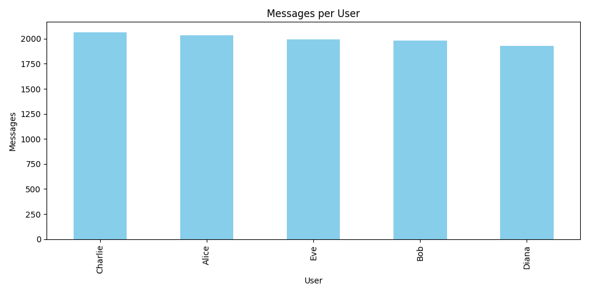
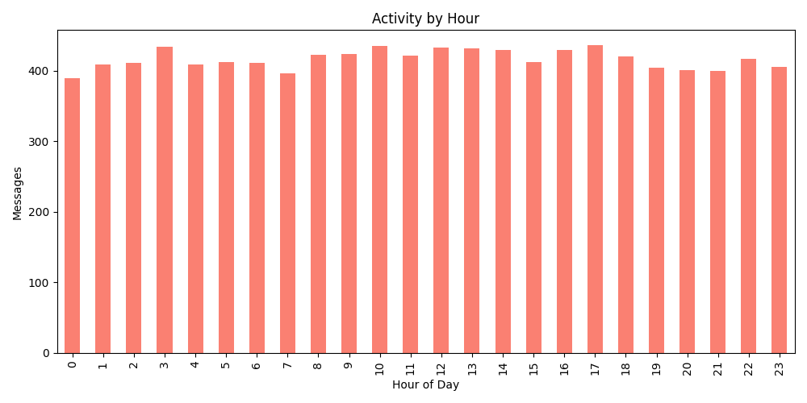
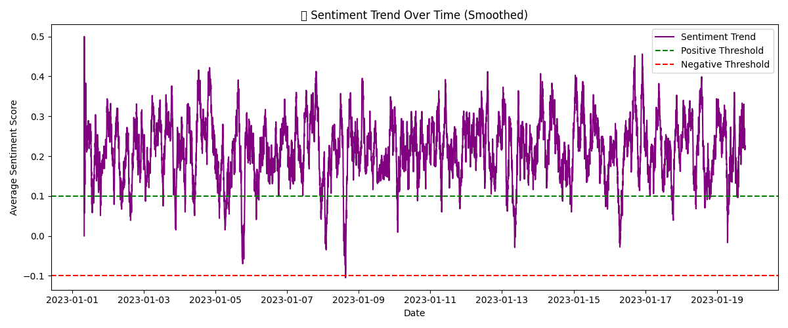

# 📊 WhatsApp Group Health Analyzer

Welcome to the **WhatsApp Group Health Analyzer** — a data analytics project designed to analyze and visualize the health and dynamics of WhatsApp group conversations using Python. Whether you're curious about group activity trends, user participation, or sentiment changes over time, this tool provides a complete overview!

---

## 🚀 Features

- 📈 **Message Frequency Analysis** – Analyze how many messages each user sends.
- ⏰ **Active Hours** – Visualize peak activity hours of the group.
- 😊 **Sentiment Analysis** – Track emotional trends and shifts in conversations over time.
- 📊 **Beautiful Visualizations** – Generate plots for easy interpretation.
- 📄 **Supports WhatsApp Exported Chat Format** – Just export from WhatsApp and upload!

---

## 🧾 Project Structure

```
.
├── Visuals/
│   ├── active_hours.png
│   ├── messages_per_user.png
│   └── sentiment_trend.png
│
├── WhatsApp Chat with Sample Group.txt
├── Whatsapp Group Health Analyzer.ipynb
├── LICENSE
└── README.md
```

---

## 📁 Files Explained

- `Whatsapp Group Health Analyzer.ipynb`: Main Jupyter Notebook where all analysis is performed.
- `WhatsApp Chat with Sample Group.txt`: Sample input file exported from WhatsApp.
- `Visuals/`: Folder containing output plots:
  - `active_hours.png`: Hourly message activity.
  - `messages_per_user.png`: Message count per user.
  - `sentiment_trend.png`: Sentiment polarity over time.

---

## 🧠 How It Works

1. 📥 **Input**: Load a `.txt` chat export from WhatsApp.
2. 🧹 **Processing**:
   - Clean and parse the message data.
   - Extract sender names, timestamps, and message content.
3. 📊 **Analysis**:
   - Count messages per user.
   - Plot hourly activity.
   - Perform sentiment analysis using `TextBlob`.
4. 🖼️ **Visual Output**: Saves charts to the `Visuals` folder for easy sharing and reporting.

---

## 📌 Requirements

Make sure you have the following Python libraries installed:

```bash
pip install pandas matplotlib seaborn textblob
python -m textblob.download_corpora
```

---

## 📸 Sample Visuals

### 📊 Messages Per User


### ⏰ Active Hours


### 😊 Sentiment Trend


---

## 💡 Use Cases

- Understand group member participation.
- Track tone changes during group discussions.
- Detect when the group is most active.
- Use as a base for WhatsApp chatbot metrics.

---

## 🤖 Future Enhancements

- Export analysis as PDF reports.
- Add emoji frequency stats.
- Detect topic clusters with NLP.
- Telegram/Discord group compatibility.

---

## 👨‍💻 About Me

I'm a Data Enthusiast passionate about extracting meaningful insights from messy data. This project blends Python, text analysis, and visualization to monitor group health in a fun, data-driven way.


## ⭐️ Support

If you found this project interesting, consider starring ⭐ the repo or sharing it with your data science friends!

---

## 📄 License

This project is licensed under the [MIT License](LICENSE).

---
